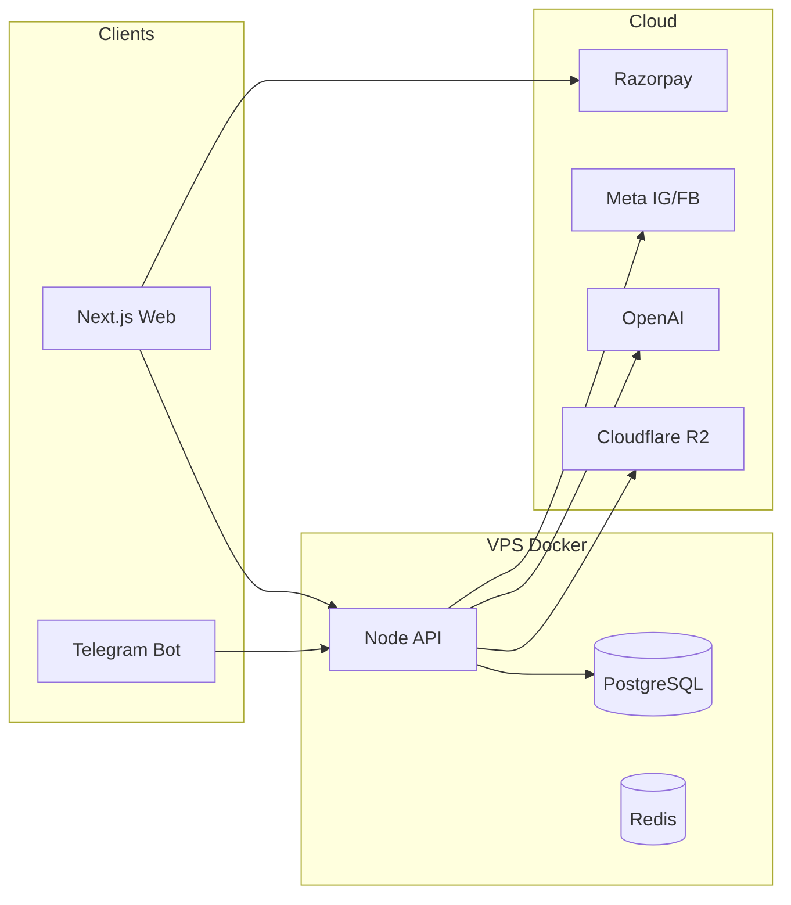

# Shaan-e-Taj — Final Product Architecture

## 1. Customer website

**Theme:** Ivory white, rose gold, Cormorant + Jost, mobile-first bridal luxury.

**Pages (implemented in `apps/web`):**

| Page | Route |
|------|--------|
| Home | `/` |
| New Arrivals | `/new-arrivals` |
| Bridal Collection | `/bridal` |
| Party Wear | `/party-wear` |
| Festive Collection | `/festive` |
| Custom Stitching | `/custom-stitching` |
| Catalog + AI search | `/catalog` |
| About Us | `/about` |
| Contact | `/contact` |
| Wishlist | `/wishlist` (auth Phase 2) |
| My Orders | `/orders` (Razorpay Phase 2) |

## 2. Telegram AI upload

```
[Team] --photo--> [Grammy Bot] --> POST /internal/process-draft
                                        |
                    +-------------------+-------------------+
                    |                   |                   |
            [Image pipeline]    [GPT-4o Vision]      [TelegramDraft DB]
            enhance/watermark   metadata JSON
                    |                   |
                    +--------+----------+
                             |
                    Team: /publish
                             |
                    POST /publish/telegram/:draftId
                             |
                    Product PUBLISHED + embedding indexed
```

## 3. One-click publish

`/publish` in Telegram calls `publishTelegramDraft()` which sets:

- `status = PUBLISHED`
- `isNewArrival = true`
- `publishedAt = now`
- Visible in catalog, filters, New Arrivals, search embeddings

## 4. Smart category detection

OpenAI returns `mainCategory` + `subCategory` enums — no manual pick required.

Enums: Bridal, Party Wear, Festive, Anarkali, Sharara, Gharara, Pakistani, Indo Western, Lehenga, Kurti Set, etc.

## 5. Stitching module

Customer-facing: Unstitched / Semi / Fully + measurement fields on `/custom-stitching`.

Admin sets charges in `SiteSettings` (`semiStitchChargePaise`, `fullStitchChargePaise`).

## 6. WhatsApp ordering

`Order on WhatsApp` builds pre-filled message with product name, category, fabric, color, price.

Analytics: `whatsapp_click` events → dashboard conversion.

## 7. AI search

`GET /products?q=red wedding suit` → OpenAI `text-embedding-3-small` + cosine similarity on stored embeddings. Falls back to text match without API key.

## 8. Instagram auto posting

Optional flags on `SiteSettings`: `autoPostInstagram`, `autoPostFacebook`.

After publish: AI caption + hashtags → Meta Graph API (`services/social.ts`).

## 9. Advanced filters

API query params: `mainCategory`, `subCategory`, `minPrice`, `maxPrice`, `color`, `fabric`, `occasion`, `inStock`, `isNewArrival`.

## 10. Customer accounts

NextAuth credentials login, wishlist API, order history, saved addresses & measurements (`/account`).

## 11. Admin dashboard

`/admin` UI + `GET /admin/dashboard` — today's sales, orders, visitors, WhatsApp clicks, conversion, top products, site settings (stitching charges, auto-post flags).

## Infrastructure



## V2 roadmap

Virtual try-on, AI stylist, outfit recommendations, multi-vendor, Hindi/English, loyalty, referrals.
